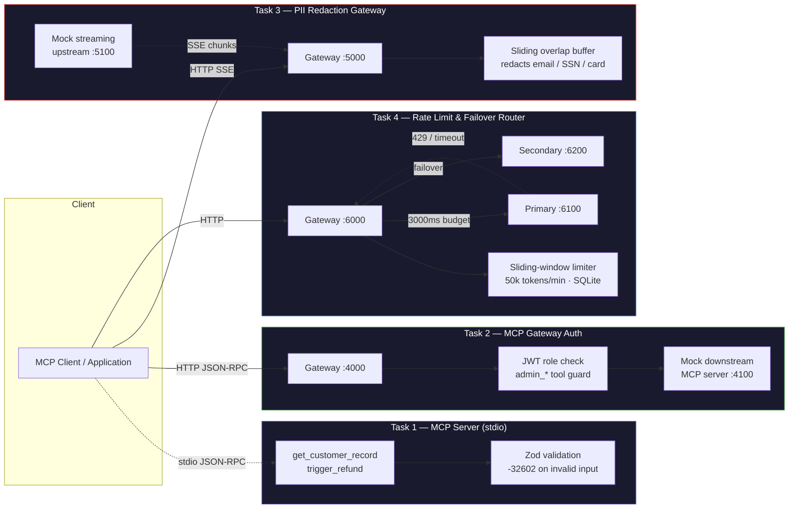

<div align="center">

# llm-gateway-patterns

**Production-grade infrastructure patterns for LLM and MCP-based systems**

Schema-validated MCP tooling · role-aware gateway auth · real-time PII redaction · rate-limited failover routing

[](https://nodejs.org)
[](https://www.typescriptlang.org)
[](https://modelcontextprotocol.io)
[](https://nodejs.org/api/sqlite.html)
[](#license)
[](#testing)

</div>

---

## Overview

Four independent, standalone services, each solving one operational problem
that shows up in every real LLM/agent deployment: validating tool input at
the protocol boundary, enforcing authorization on privileged tools, keeping
PII out of streamed model output, and surviving upstream provider outages
without leaking internals. Each task ships with its own `package.json`,
tests, and README — no shared dependency tree, no monorepo tooling required.

| # | Service | Solves |
|---|---------|--------|
| 1 | [MCP Server](task-1-mcp-server/) | Schema-validated tool calls over stdio, real JSON-RPC error codes |
| 2 | [MCP Gateway Auth](task-2-mcp-gateway-auth/) | Role-based access control in front of an MCP server |
| 3 | [PII Redaction Gateway](task-3-llm-pii-redaction-gateway/) | Streaming redaction without buffering the response |
| 4 | [Rate Limit & Failover Router](task-4-llm-rate-limit-fallback-router/) | Per-tenant quotas and automatic provider failover |

---

## Architecture



---

## Services

### 1 · [MCP Server](task-1-mcp-server/)

MCP tool server over stdio, built on the SDK's low-level `Server` class so
Zod validation failures surface as real top-level JSON-RPC errors
(`-32602 Invalid params`) instead of being wrapped into a tool-result payload.

- `get_customer_record(customer_id)` — pattern-validated (`^CUST-[A-Z0-9]{5}$`)
- `trigger_refund(customer_id, amount, reason)` — positive amount, min-length reason
- stdout carries **JSON-RPC only** — all logging routed to stderr via `pino`

```bash
cd task-1-mcp-server && npm install && npm run dev
```

### 2 · [MCP Gateway Auth](task-2-mcp-gateway-auth/)

Reverse proxy in front of a downstream MCP server. Verifies a signed JWT's
`role` claim on every request and blocks non-admins from calling any
`admin_`-prefixed tool — rejected locally, before downstream is ever touched.

```bash
cd task-2-mcp-gateway-auth && npm install && cp .env.example .env && npm run dev
```

### 3 · [PII Redaction Gateway](task-3-llm-pii-redaction-gateway/)

Proxies a streaming completion and redacts emails, SSNs, and card-like
numbers **in flight**, using a sliding overlap buffer so a pattern split
across two chunk boundaries still gets caught — without ever buffering the
full response in memory.

```bash
cd task-3-llm-pii-redaction-gateway && npm install && cp .env.example .env && npm run dev
```

### 4 · [Rate Limit & Failover Router](task-4-llm-rate-limit-fallback-router/)

Per-tenant sliding-window token rate limiter (50,000 tokens/min) backed by
on-disk SQLite, with primary→secondary failover on `429` or a 3000ms
timeout via `AbortController`. Errors returned to the client are sanitized —
no upstream stack traces, URLs, or provider internals ever leak.

```bash
cd task-4-llm-rate-limit-fallback-router && npm install && cp .env.example .env && npm run dev
```

---

## Testing

Each service that has non-trivial logic to verify ships its own test suite:

```bash
cd task-3-llm-pii-redaction-gateway && npm test   # in-chunk, split-boundary, passthrough
cd task-4-llm-rate-limit-fallback-router && npm test   # cap enforcement, sliding window, concurrency
```

Task 4's suite includes a real 20-worker-thread concurrency test that proves
the token cap holds under concurrent load from separate SQLite connections —
not just sequential requests.

---

## Documentation

| Document | Contents |
|---|---|
| [CHANGELOG.md](CHANGELOG.md) | Full build log, bugs found and fixed, verification results |
| [DEVIATIONS.md](DEVIATIONS.md) | Every place the implementation diverged from spec, and why |

---

## License

[MIT](LICENSE)

---

<div align="center">

Built and maintained by **Eklavya Prasad**

[GitHub](https://github.com/eklavya114) · [llm-gateway-patterns](https://github.com/eklavya114/llm-gateway-patterns)

</div>
